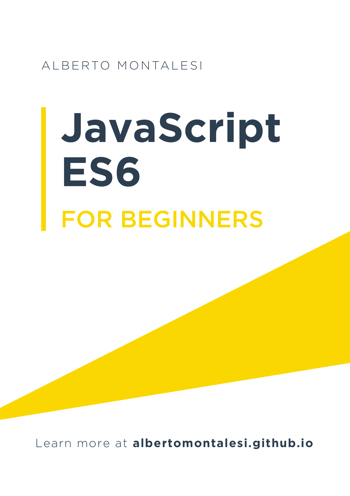

# JavaScript ES6 for beginners

## Disclaimer

This book is intended for somebody already familiar with the basics of JavaScript, as I am only focusing on the new features introduced by ES6 and I won't be explaining what is a `var`, how to create a function, etc...

## About me

My name is Alberto, I'm from Italy and I love programming.
As I was studying ES6 I decided that the best way for me to test my understanding of it was to write articles about it. I have now packaged those articles in a free ebook that you can read here or on my blog [here](http://albertomontalesi.github.io/).

## Contributions & Donations

Any contributions you make are of course greatly appreciated.

If you enjoy my content and you want to donate me a cup of coffee, you can do [here](paypal.me/albertomontalesi).

## Table of contents

* [Chapter 1: Var vs Let vs Const & the temporal dead zone](https://github.com/AlbertoMontalesi/JavaScript-ES6-for-beginners-ebook/blob/master/ebook/01_var_let_const.md)
* [Chapter 2: Arrow functions](https://github.com/AlbertoMontalesi/JavaScript-ES6-for-beginners-ebook/blob/master/ebook/02_arrow_functions.md)
* [Chapter 3: Default function arguments](https://github.com/AlbertoMontalesi/JavaScript-ES6-for-beginners-ebook/blob/master/ebook/03_default_function_arguments.md)
* [Chapter 4: Template literals](https://github.com/AlbertoMontalesi/JavaScript-ES6-for-beginners-ebook/blob/master/ebook/04_template_literals.md)
* [Chapter :5 Additional string methods](https://github.com/AlbertoMontalesi/JavaScript-ES6-for-beginners-ebook/blob/master/ebook/05_additional_string_methods.md)
* [Chapter 6: Destructuring](https://github.com/AlbertoMontalesi/JavaScript-ES6-for-beginners-ebook/blob/master/ebook/06_destructuring.md)
* [Chapter 7: Iterables and looping](https://github.com/AlbertoMontalesi/JavaScript-ES6-for-beginners-ebook/blob/master/ebook/07_iterables%20and%20looping.md)
* [Chapter 8: Array improvements](https://github.com/AlbertoMontalesi/JavaScript-ES6-for-beginners-ebook/blob/master/ebook/08_array_improvements.md)
* [Chapter 9: Spread operator and rest parameters](https://github.com/AlbertoMontalesi/JavaScript-ES6-for-beginners-ebook/blob/master/ebook/09_spread_operator_and_rest_parameters.md)
* [Chapter 10: Object literal upgrades](https://github.com/AlbertoMontalesi/JavaScript-ES6-for-beginners-ebook/blob/master/ebook/10_object_literal_upgrades.md)
* [Chapter 11: Symbols](https://github.com/AlbertoMontalesi/JavaScript-ES6-for-beginners-ebook/blob/master/ebook/11_symbols.md)
* [Chapter 12: Classes](https://github.com/AlbertoMontalesi/JavaScript-ES6-for-beginners-ebook/blob/master/ebook/12_classes.md)
* [Chapter 13: Promises](https://github.com/AlbertoMontalesi/JavaScript-ES6-for-beginners-ebook/blob/master/ebook/13_promises.md)
* [Chapter 14: Generators](https://github.com/AlbertoMontalesi/JavaScript-ES6-for-beginners-ebook/blob/master/ebook/14_generators.md)
* [Chapter 15: Proxies](https://github.com/AlbertoMontalesi/JavaScript-ES6-for-beginners-ebook/blob/master/ebook/15_proxies.md)
* [Chapter 16: Sets, WeakSets, Maps and WeakMaps](https://github.com/AlbertoMontalesi/JavaScript-ES6-for-beginners-ebook/blob/master/ebook/16_sets_weaksets_maps_weakmaps.md)

## License

 This work is licensed under a <a rel="license" href="http://creativecommons.org/licenses/by-nc-nd/3.0/">Creative Commons Attribution-NonCommercial-NoDerivs 3.0 Unported License</a>.