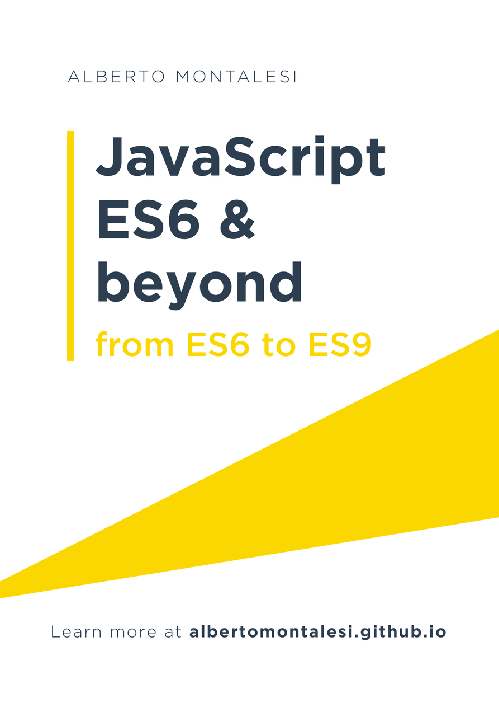

# JavaScript ES6 and beyond: Discover all the new features introduced to JavaScript from 2015 to 2018

## Disclaimer

This book is intended for somebody already familiar with the basics of JavaScript, as I am only focusing on the new features introduced by ES6 and I won't be explaining what is a `var`, how to create a function, etc...

## About me

My name is Alberto, I'm from Italy and I love programming. As I was studying ES6 I decided that the best way for me to test my understanding of it was to write articles about it. I have now packaged those articles in a free ebook that you can read here or on my blog [here](http://albertomontalesi.github.io/).

## Contributions & Donations

Any contributions you make are of course greatly appreciated.

If you enjoy my content and you want to donate me a cup of coffee, you can do so [here](https://github.com/AlbertoMontalesi/JavaScript-ES6-for-beginners-ebook/tree/33fc6a922b67c3f7e105bd14b3828b77a67ebdb4/paypal.me/albertomontalesi/README.md).

## License

 This work is licensed under a <a rel="license" href="http://creativecommons.org/licenses/by-nc-nd/3.0/">Creative Commons Attribution-NonCommercial-NoDerivs 3.0 Unported License</a>.
